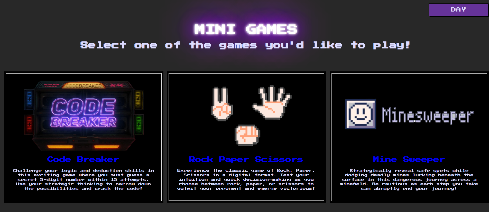
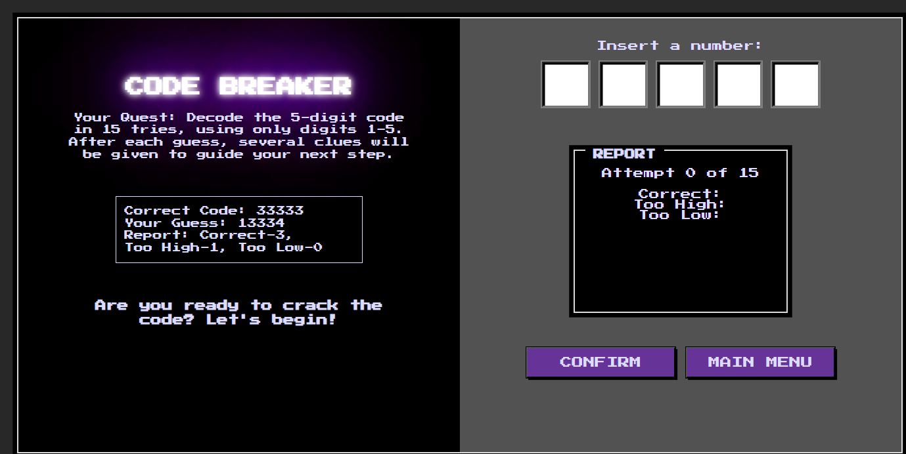
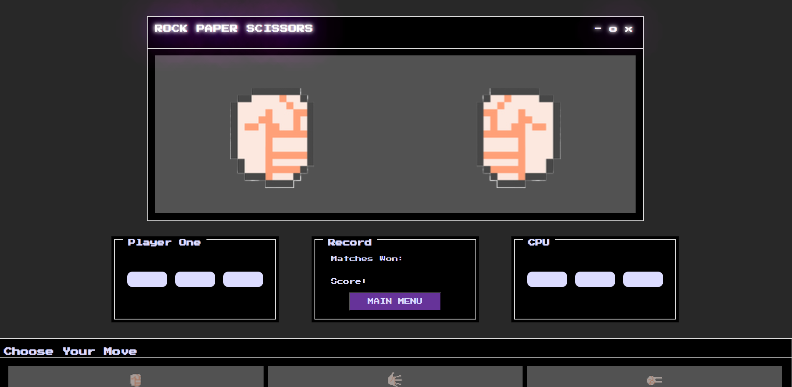
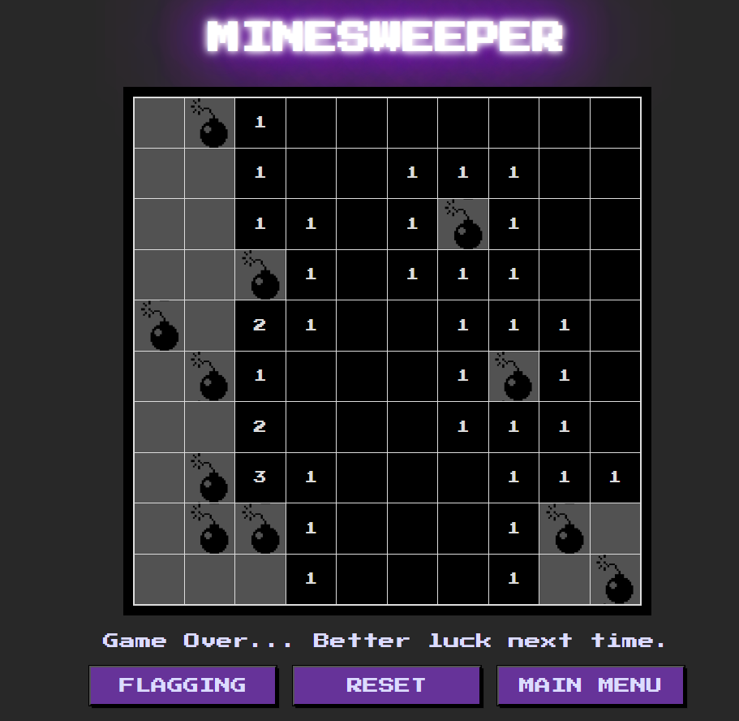

# 🎮 Retro Mini Games – JavaScript Browser Arcade

A collection of classic retro-inspired mini games built using HTML, CSS, and Vanilla JavaScript.

This project features multiple interactive browser games with a customizable day and night theme interface.

---

## 🚀 Features

### 🏠 Home Page
- Retro-style UI
- Navigation to 3 mini games
- Toggleable Day/Night theme switch
- Responsive layout

---

## 🕹 Included Games

### 1️⃣ Crack the Code (Number Guessing Game)
- Player attempts to guess a randomly generated number
- Feedback system for incorrect guesses
- Win condition detection

---

### 2️⃣ Rock Paper Scissors (vs CPU)
- Player vs Computer logic
- Randomized CPU move generator
- Score tracking
- Dynamic result display

---

### 3️⃣ Minesweeper
- Interactive grid-based game
- Random mine placement
- Game over detection
- Reveal logic and win condition

---

## 🌗 Theme Feature

- Toggle between Day and Night mode
- Dynamically changes UI colors
- Improves user experience

---

## 🛠 Technologies Used

- HTML5
- CSS3
- JavaScript (Vanilla JS)
- DOM Manipulation
- Event Handling
- Game Logic Algorithms

---

## 📱 Responsiveness

Optimized for:
- Desktop
- Mobile devices

---

## 🎯 Project Purpose

This project demonstrates:
- Game logic implementation
- JavaScript event-driven programming
- DOM manipulation
- State management
- UI theme switching

Developed as part of my college web development projects.

---
## Screenshots 

## 👨‍💻 Author

**Micko Baldonado**  
4th Year Computer Engineering Student

https://www.linkedin.com/in/baldonadomicko/
